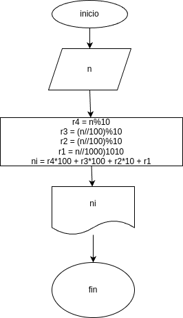

# invertir_numero
programa para revertir numeros de cuatro digito

##  Analisis

### Variables de entrada
- n: Digite el numero de 4 digitos
### procedimiento
- r4 = n%10
- r3 = (n//10)%10
- r2 = (n//100)%10
- r1 = (n//1000)%10

ni = r4*1000 + r3*100 + r2*10 + r1

## Diseño

## construcion
